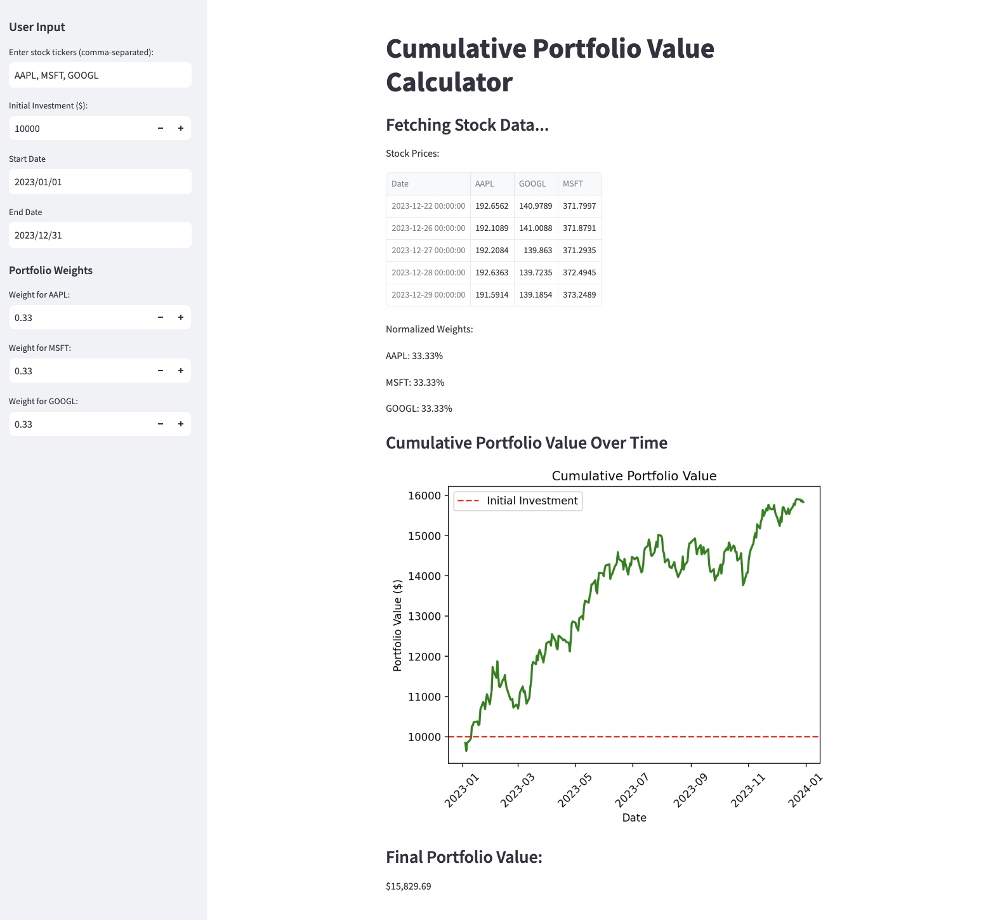

# Investment Dashboard

A Python-based web app for analyzing and visualizing portfolio performance using real-time stock data.

## Features
- Fetches stock data using `yfinance`.
- Allows users to:
  - Specify stock tickers.
  - Assign portfolio weights.
  - Input initial investment.
- Visualizes:
  - Cumulative portfolio value over time.
  - Final portfolio value at the end of the selected date range

## Installation

To run this app locally, follow these steps:

1. Clone the repository:
   ```bash
   git clone https://github.com/m-atthew7/investment-dashboard.git
   
2. Navigate to the project directory
   ```bash
   cd investment-dashboard
   
3. Install the required libraries:
   ```bash
   pip install -r requirements.txt
   
4. Run the app:
   ```bash
   streamlit run portfolio_app.py

## Usage
- Input stock tickers (e.g., AAPL, MSFT).
- Specify portfolio weights (e.g., 0.4, 0.6).
- Enter the initial investment amount.
- View:
  - Cumulative portfolio value over tinme.
  - Final portfolio value at the end of the selected date range.
 
## Dependencies
- `streamlit`
- `yfinance`
- `numpy`
- `pandas`
- `matplotlib`

## Demo


## Live Demo
Check out the live app [here](https://m-atthew7-investment-dashboard-portfolio-app-umzy3m.streamlit.app/)
